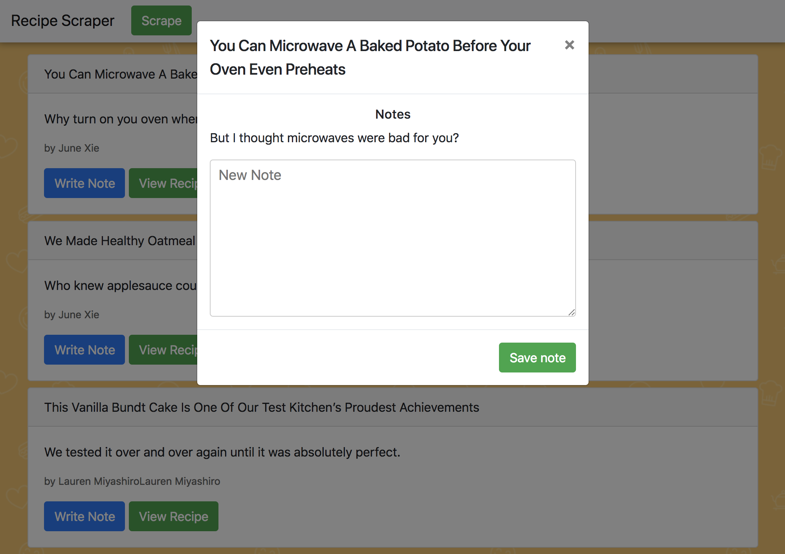

# recipe-scraper

This is a full-stack web scraper that pulls in data from [www.delish.com/cooking/recipe-ideas](www.delish.com/cooking/recipe-ideas). Express was used to architect the routes and Mongo/mongoose for the database, all of which is hosted on heroku at [https://desolate-sands-92143.herokuapp.com/](https://desolate-sands-92143.herokuapp.com/). Articles and Notes reference each other using Mongoose to display user-created notes left on each article, which come up as a Bootstrap modal.

To run this app locally, you must have Mongo and Node installed. Clone the repo, `cd` into it, and run `npm install`. Make sure Mongo is running, and then run `node server.js`, which will run the app at [localhost:3000](localhost:3000) by default.

---
For more information, email [cadin.mcqueen@gmail.com](mailto:cadin.mcqueen@gmail.com).
